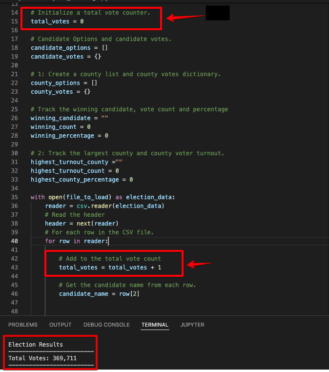
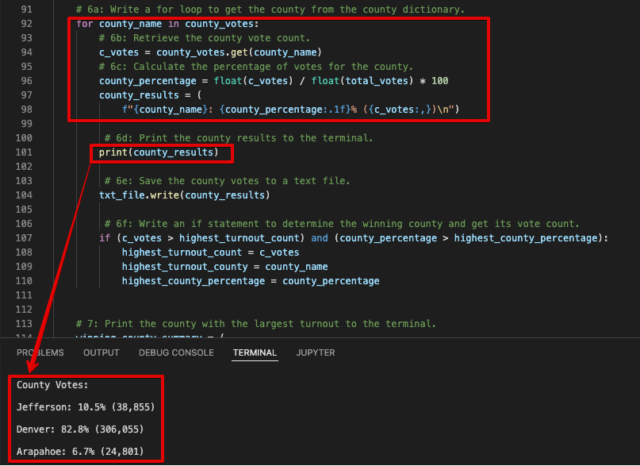
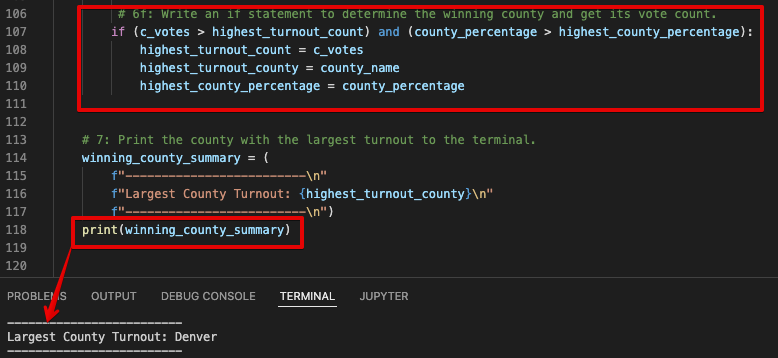
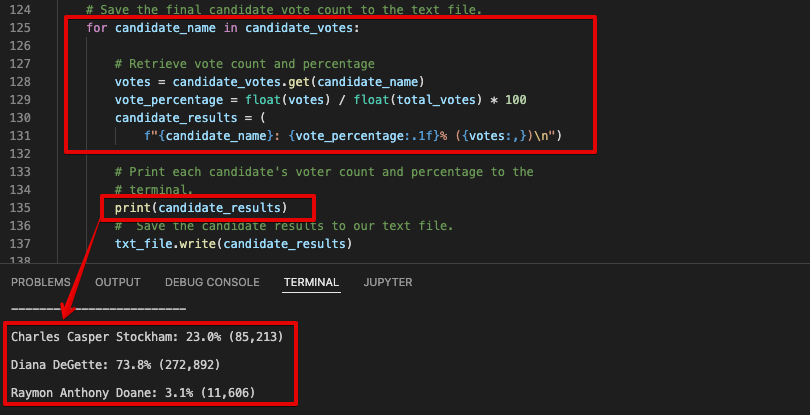
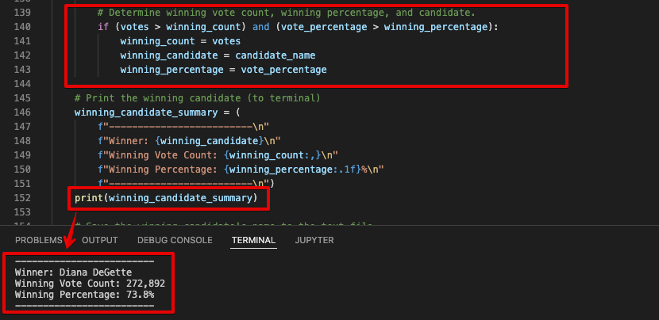

# Overview of Election Audit:
## Purpose
The election commission has requested some additional data to complete the audit:
- The voter turnout for each county
- The percentage of votes from each county out of the total count.
- The county with the highest turnout

In this project, we will use raw data from `election_results.csv` to find required information for the audit.

# Election-Audit Results:
Below are results of election audit results. 

### `How many votes were cast in this congressional election? `

There are total **`369,711`** Votes castes in the election.

### `Provide a breakdown of the number of votes and the percentage of total votes for  each county in the precinct.`
Breakdown by each county in precinct by percentage and number of votes.
- Jefferson: 10.5% (38,855)
- Denver: 82.8% (306,055)
- Arapahoe: 6.7% (24,801)

### `Which county had the largest number of votes?`
County with largest turnout is `Denver`.

### `Provide a breakdown of the number of votes and the percentage of the total votes each candidate received.`
Breakdown by each candidate in precinct by percentage and number of votes
- Charles Casper Stockham: 23.0% (85,213)
- Diana DeGette: 73.8% (272,892)
- Raymon Anthony Doane: 3.1% (11,606)

### `Which candidate won the election, what was their vote count, and what was their percentage of the total votes?`
The winning candidate is `Diana DeGette` with `272,892 (73.8%)` votes.

# Election-Audit Summary

There are total **`369,711`** Votes castes in the election. Denver had the largest turnout in terms of votes. At the end, `Diana DeGette` with `272,892 (73.8%)` votes.

This script created for Election Audit can be used for following purposes.

**Union Body Elections:** The script can be used to audit Union Body elections. It can help identify the winning candidates. Different union body positions can be identifed instead of counties to find winning candidates for each position

**State Elections:** This script can be extended to State elections by adding States information in the ballot raw data. Another _'for loop'_ and conditional statement will be added to capture state level winners.
